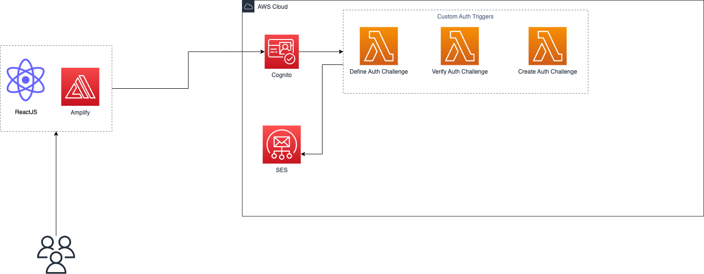

<a name="readme-top"></a>
# 🔐 Amazon Cognito Passwordless Authenticator

<!-- PROJECT SHIELDS -->
<!--
*** I'm using markdown "reference style" links for readability.
*** Reference links are enclosed in brackets [ ] instead of parentheses ( ).
*** See the bottom of this document for the declaration of the reference variables
*** for contributors-url, forks-url, etc. This is an optional, concise syntax you may use.
*** https://www.markdownguide.org/basic-syntax/#reference-style-links
-->


<!-- PROJECT ACTIONS -->
<div align="left">
  <p align="left">
    <br />
    <a href="https://github.com/gjyoungjr/cognito_passwordless_auth"><strong>Explore the docs »</strong></a>
  </p>
</div>

<!-- TABLE OF CONTENTS -->
<details>
  <summary>Table of Contents</summary>
  <ol>
    <li>
      <a href="#about-the-project">About The Project</a>
      <ul>
        <li><a href="#architecture">Architecture</a></li>
      </ul>
    </li>
    <li>
      <a href="#getting-started">Getting Started</a>
      <ul>
        <li><a href="#prerequisites">Prerequisites</a></li>
        <li><a href="#installation">Installation</a></li>
        <li><a href="#deploy">Deployment</a></li>
      </ul>
    </li>
    <li><a href="#license">License</a></li>
    <li><a href="#contact">Contact</a></li>
 
  </ol>
</details>

<!-- ABOUT THE PROJECT -->

## About The Project

This project contains a passwordless authenticator app that was built using Amazon Cognito. Cognito provides the ability to define a custom auth flow. The auth flow process of the application uses one-time login codes that are sent via email. There are many benefits
of using a one-time login codes such as :

- Prevents identity theft by making sure that a captured username/password pair cannot be used a second time
- Users do not need to worry about remembering their passwords

<p align="right">(<a href="#readme-top">back to top</a>)</p>

<!-- ARCHITECTURE -->
### Architecture



<p align="right">(<a href="#readme-top">back to top</a>)</p>

<!-- GETTING STARTED -->

## Getting Started

This is an example of how you may give instructions on setting up your project locally.
To get a local copy up and running follow these simple example steps.

### Prerequisites

1. Install the serverless framework CLI via NPM:
  ```bash
  npm install -g serverless
  ```
2. Install Amplify CLI via NPM:
  ```bash
  npm install -g @aws-amplify/cli
  ```

### Installation
The below steps explains how to install and set up the application.

1. Clone the repo
   ```bash
   git clone https://github.com/gjyoungjr/cognito_passwordless_auth
   ```
2. Install NPM packages
   ```bash
   npm install
   ```
3. Enter your AWS Access Key ID and Secret Access Key in an env file `.env`
   ```js
    AWS_ACCESS_KEY_ID=<ACCESS_KEY_ID>
    AWS_SECRET_ACCESS_KEY=<SECRET_ACCESS_KEY>
   ```
4. Navigate to the web app directory 
    ```bash
    cd web-app/authenticator
   ```
5. Initialize Amplify and enter your AWS Credentials (AWS Access Key ID & Secret Access Key). You can follow this [guide](https://docs.amplify.aws/cli/start/install/#option-2-follow-the-instructions) to get more details regarding 
    setting up Amplify. 
    ```bash
    amplify init
    ```
### Deploy 
1. Deploy Stack to AWS 
    ```bash 
    npm run deploy 
    ```

<p align="right">(<a href="#readme-top">back to top</a>)</p>

<!-- LICENSE -->

## License

Distributed under the MIT License. See `LICENSE.txt` for more information.

<p align="right">(<a href="#readme-top">back to top</a>)</p>

<!-- CONTACT -->

## Contact

Gilbert Young Jr - [@your_twitter](https://twitter.com/gjyoungjr) - gilbertjyoungjr@gmail.com.com

Project Link: [https://github.com/your_username/repo_name](https://github.com/your_username/repo_name)

<p align="right">(<a href="#readme-top">back to top</a>)</p>
